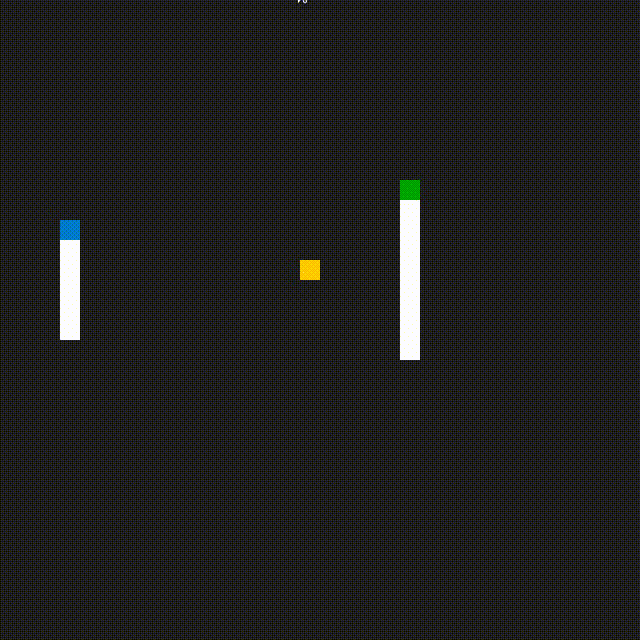
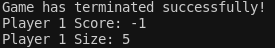
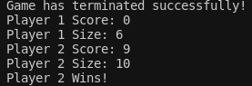

# Capstone Project: Snake Game 

This is a repo for the Capstone project in the [Udacity C++ Nanodegree Program](https://www.udacity.com/course/c-plus-plus-nanodegree--nd213). The project is Snake Game, which extends from the [original snake game repo](https://github.com/udacity/CppND-Capstone-Snake-Game) provided by Udacity.

## Dependencies for Running Locally
* cmake >= 3.7
  * All OSes: [click here for installation instructions](https://cmake.org/install/)
* make >= 4.1 (Linux, Mac), 3.81 (Windows)
  * Linux: make is installed by default on most Linux distros
  * Mac: [install Xcode command line tools to get make](https://developer.apple.com/xcode/features/)
  * Windows: [Click here for installation instructions](http://gnuwin32.sourceforge.net/packages/make.htm)
* SDL2 >= 2.0
  * All installation instructions can be found [here](https://wiki.libsdl.org/Installation)
  >Note that for Linux, an `apt` or `apt-get` installation is preferred to building from source. 
* gcc/g++ >= 5.4
  * Linux: gcc / g++ is installed by default on most Linux distros
  * Mac: same deal as make - [install Xcode command line tools](https://developer.apple.com/xcode/features/)
  * Windows: recommend using [MinGW](http://www.mingw.org/)

## Basic Build Instructions

1. Clone this repo.
2. Make a build directory in the top level directory: `mkdir build && cd build`
3. Compile: `cmake .. && make`
4. Run it: `./SnakeGame`.
5. Input string "1" or "one" for 1 player, "2" or "two" for 2 players in terminal.

## How to play

### One player

1. The player control snake using key "Up", "Down", "Left" and "Right".
2. Eat the food (yellow block) to gain score.
3. The game will end when the snake eat its own body.
4. The score will be printed out after the game terminated, as shown below:

### Two players

1. 1st player control snake using key "Up", "Down", "Left" and "Right", while 2nd player control by using key "W", "S", "A" and "D".
2. Eat the food (yellow block) to gain score, the player who get the highest scores after the game ends wins.
3. The game will end when one snake eat its own body or the another snake's body.
4. The snake which eat its own body or another snake's body will get a penalty of score deduction of 5.
5. The result will be printed out after the game terminated, as shown below:

## Rubic points

### Loops, Functions, I/O

1. The project demonstrates an understanding of C++ functions and control structures. - Every cpp files.
2. The project accepts user input and processes the input. - game.cpp (line 136 - 151).

### Object Oriented Programming

1. The project uses Object Oriented Programming techniques. - Every header files.
2. Classes use appropriate access specifiers for class members. - game.h.
3. Classes abstract implementation details from their interfaces. - game.cpp (line 49, 111, 138, 159).
4. Classes encapsulate behavior. - game.h (line 44 - 47).
5. Overloaded functions allow the same function to operate on different parameters. - controller.h (line 8, 9), controller.cpp (line 12 - 92).
